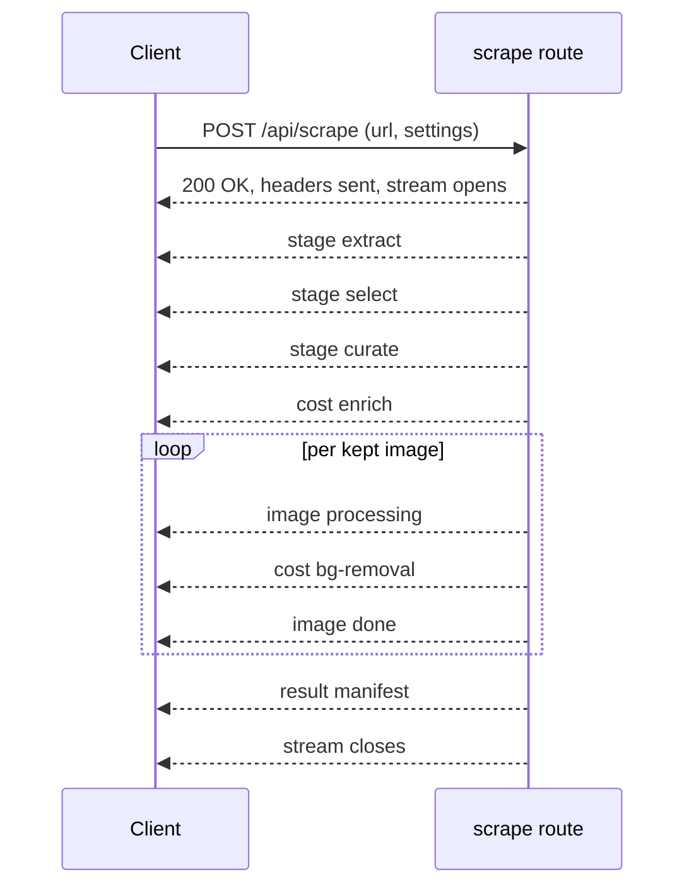

> Generated: 2026-07-26 · Commit: 0f2c759 · Generator: make-docs

# API Reference

All routes are Next.js App Router handlers under `app/api/`. Every route file
sets `export const runtime = 'nodejs'` and `export const dynamic = 'force-dynamic'`.
There are no server actions in this codebase — every endpoint is a `route.ts` handler.

There are no webhooks in this repo (no inbound webhook receiver exists anywhere
in `app/api/`) — that section is omitted rather than invented.

## Conventions

**Auth.** Sessions are stateless HMAC-SHA256-signed cookies (`sp_session`,
`core/auth.ts:10`), verified per request — there is no server-side session
store. Two guard functions gate routes:

| Guard | Checks | Used for |
|---|---|---|
| `requireRole(req, role?)` | Signature + expiry from the cookie's embedded claims only | Read-heavy / low-risk routes |
| `requireRoleFresh(req, role?)` | Same, plus re-fetches the user row from the DB to catch a live demotion/deletion | Admin mutations |
| `sessionFromReq(req)` | Parses/verifies the cookie, no role check | `/api/auth/change-password`, `/api/auth/me` |

Edge `middleware.ts` only checks cookie *presence* for page routes (not `/api/*`)
and redirects to `/login` — it is explicitly not the security boundary. Every
API route re-verifies the signature itself via `core/auth.ts`.

**Error envelope.** Almost every JSON route returns `{ error: string }` on
failure. A few routes intentionally return HTTP 200 with an `ok:false`/`error`
body instead, for outcomes meant for UI display rather than exception handling
(noted per-endpoint below: `/api/stores/test`, `/api/stores` GET on list
failure, `/api/test`).

| HTTP status | Meaning across this API |
|---|---|
| `400` | Client input validation failure (missing/malformed field, bad URL, SSRF-guard rejection) |
| `401` | No/invalid session, or wrong current password on change-password |
| `403` | Valid session, but role insufficient for an admin-gated action |
| `404` | Target entity not found (`/api/users` PATCH) |
| `409` | Conflict — duplicate email on `/api/users` POST |
| `429` | Per-user daily safety cap exceeded (`/api/discover`, `/api/scrape`) |
| `502` | Upstream/store call failed or returned unusable data |
| `503` | `DATABASE_URL` not set for a feature that requires the DB |
| `500` | Unexpected server-side exception |

**Settings body.** Several routes accept an optional `settings` object in the
request body — a partial `Settings` (`core/settings.ts:4-29`). It is merged
DB → env → client-supplied, in that order, before use (`resolveSettings`,
`core/settings.ts:57-78`); `storeBase`/`storeToken` never fall back to the
client-supplied value. Examples below show only the fields relevant to that
endpoint, not the full 30-field shape.

---

## Auth — `/api/auth/*`

| Method | Path | Auth | Purpose | Source |
|---|---|---|---|---|
| POST | `/api/auth/login` | none | Email+password → issue signed session cookie | `app/api/auth/login/route.ts` |
| POST | `/api/auth/logout` | none | Clear the session cookie | `app/api/auth/logout/route.ts` |
| GET | `/api/auth/me` | `sessionFromReq` (optional) | Return current session identity, or `null` | `app/api/auth/me/route.ts` |
| POST | `/api/auth/change-password` | `sessionFromReq` (any session) | Logged-in user changes their own password | `app/api/auth/change-password/route.ts` |
| POST | `/api/auth/request-reset` | none | Email a password-reset link via Resend | `app/api/auth/request-reset/route.ts` |
| POST | `/api/auth/reset` | none (token is the credential) | Consume reset token, set a new password | `app/api/auth/reset/route.ts` |

### `POST /api/auth/login`

Request:
```ts
{ email: string, password: string }
```

Response `200`:
```ts
{ ok: true, user: { email: string, role: 'admin' | 'operator', must_change: boolean } }
```
`Set-Cookie: sp_session=<token>` is set on success. Role is coerced server-side
to `'admin'` only if the stored `role === 'admin'`, else `'operator'`
(`route.ts:24`) — the client cannot request a role.

A constant `DUMMY_HASH` is verified against when the email doesn't exist, so
`verifyPassword` (scrypt) always runs once — response timing doesn't leak
account existence (`route.ts:9-11,20`).

| Status | Condition |
|---|---|
| `400 {error:'الإيميل وكلمة السر مطلوبين'}` | `email` or `password` missing/empty (`route.ts:17`) |
| `401 {error:'الإيميل أو كلمة السر غلط'}` | User not found, or `verifyPassword` fails (`route.ts:22`) |

Example:
```json
// → POST /api/auth/login
{ "email": "ops@example.com", "password": "correct horse battery staple" }

// ← 200
{ "ok": true, "user": { "email": "ops@example.com", "role": "operator", "must_change": false } }
```

### `POST /api/auth/logout`

No request body. Always `200 {ok:true}`, with `Set-Cookie` clearing the cookie
(`Max-Age=0`, `route.ts:9-11`).

### `GET /api/auth/me`

No auth is enforced — `sessionFromReq` returns `null` on a missing/invalid
cookie instead of a 401.

Response `200`:
```ts
{ user: { email: string, role: 'admin' | 'operator' } | null }
```

Example:
```json
// ← 200 (logged out)
{ "user": null }
// ← 200 (logged in)
{ "user": { "email": "ops@example.com", "role": "operator" } }
```

### `POST /api/auth/change-password`

Request:
```ts
{ current: string, next: string }
```

Response `200 {ok:true}` — password updated, `must_change` forced to `false`
(`route.ts:19-20`).

| Status | Condition |
|---|---|
| `401 {error:'unauthorized'}` | No valid session cookie (`route.ts:11`) |
| `400 {error:'كلمة المرور الجديدة قصيرة (٨ أحرف+)'}` | `next.length < 8` (`route.ts:15`) |
| `401 {error:'كلمة السر الحالية غلط'}` | User missing, or `verifyPassword(current, ...)` fails (`route.ts:18`) |

### `POST /api/auth/request-reset`

Request:
```ts
{ email: string }
```

Always returns `200 {ok:true}` **regardless of whether the account exists**,
to prevent email enumeration (`route.ts:2,17-23`). If the user exists, a reset
token is generated, its hash stored (`setResetToken`, best-effort — errors
swallowed), and a reset email sent via Resend (also best-effort).

| Status | Condition |
|---|---|
| `400 {error:'الإيميل مطلوب'}` | `email` empty (`route.ts:14`) |

Security note: the reset link's host is never taken from the untrusted `Host`
header directly. It uses `APP_URL` if set, else an allow-listed host set
(`baw-ai.dev`, `admin.baw-ai.dev`, `scraper-pro-zeta.vercel.app`), else falls
back to `https://baw-ai.dev` (`route.ts:29-35`) — defends against a poisoned
`Host` header stealing the live reset token.

### `POST /api/auth/reset`

Request:
```ts
{ token: string, password: string }
```

Response `200 {ok:true}` — password updated (`route.ts:17-18`).

| Status | Condition |
|---|---|
| `400 {error:'التوكن وكلمة مرور (٨ أحرف+) مطلوبين'}` | No `token`, or `password.length < 8` (`route.ts:13`) |
| `400 {error:'الرابط غير صالح أو منتهي الصلاحية'}` | `getUserByValidResetHash` finds no row — token invalid or expired (`route.ts:16`) |

---

## Scrape / Discover / Save

The core pipeline: find product pages (`discover`), pull one product's data
and images (`scrape`), push a reviewed manifest to a store (`save`).

| Method | Path | Auth | Purpose | Source |
|---|---|---|---|---|
| POST | `/api/discover` | `requireRole` (any role) | Find product-page URLs from a domain, listing page, or text query | `app/api/discover/route.ts` |
| POST | `/api/scrape` | `requireRole` (any role) | Core scraping pipeline; streams NDJSON progress | `app/api/scrape/route.ts` |
| POST | `/api/save` | `requireRole` (any role) | Push a reviewed manifest through a save adapter | `app/api/save/route.ts` |

### `POST /api/discover`

`maxDuration = 60`; internal soft deadline `TIME_BUDGET_MS = 48_000`
(`route.ts:16,19`).

Rate limit: if `DATABASE_URL` is set, a per-user daily counter `discover:{uid}`
is bumped against `DAILY_DISCOVER_CAP` (env, default `150`) (`route.ts:97-100`).

Request:
```ts
{
  query?: string,       // CATEGORY mode: free-text product type
  site?: string,        // optional site-scope for query mode
  url?: string,          // DOMAIN mode: a bare domain or listing/category page
  limit?: number,        // default 10, clamped to max 20
  settings?: Partial<Settings>,
}
```

Two mutually exclusive modes, chosen by whether `query` is non-empty:

- **CATEGORY mode** (`query` set) — searches the web for the product type via
  `searchProductPages`. Each result page is classified: ≥4 harvested product
  links → treated as a listing (its products are added); fewer → the page
  itself is a product page and is added directly (`route.ts:129-148`).
- **DOMAIN mode** (`query` empty, `url` required) — sitemap-first product
  harvest, then a direct scan of the given page, then discovery of
  shop/collection-style pages on the same host (`route.ts:150-187`).

Response `200` (both modes, same shape):
```ts
{ productUrls: string[], count: number, warnings: string[] }
```
An empty result adds a `warnings` entry rather than an error status
(`route.ts:146,186`).

| Status | Condition |
|---|---|
| `429 {error:'وصلت سقف الأمان اليومي للاكتشاف (${cap})...'}` | Daily discover cap exceeded (`route.ts:100`) |
| `400 {error:'a domain or listing URL is required'}` | DOMAIN mode with no `url` (`route.ts:152`) |
| `400 {error: <message>}` | `url` fails `assertPublicUrl` — the SSRF guard (private IP, localhost, non-http(s)) (`route.ts:156`) |

Example (DOMAIN mode):
```json
// → POST /api/discover
{ "url": "shop.example.com", "limit": 5 }

// ← 200
{
  "productUrls": [
    "https://shop.example.com/products/silk-robe",
    "https://shop.example.com/products/lace-set"
  ],
  "count": 2,
  "warnings": ["sitemap: لقينا 2 منتج من خريطة الموقع مباشرة"]
}
```

### `POST /api/save`

`maxDuration = 60` (`route.ts:12`).

Request:
```ts
{
  manifest: Manifest,          // see Manifest type below (from a prior /api/scrape result)
  adapter?: string,            // default 'kiss-play'; 'json' is handled client-side only
  storeId?: number | 'env',    // explicit destination; omitted → DB default store; 'env' → legacy env/settings store
  settings?: Partial<Settings>,
}
```

Destination resolution (`route.ts:27-38`): if the DB is configured and
`storeId !== 'env'` — an explicit `storeId` must resolve to a store that
already has a token; otherwise the DB's flagged default store is used if it
has a token; otherwise it falls through to the legacy `storeBase`/`storeToken`
(env or client settings).

Response — the adapter's `SaveResult` (`adapters/kissplay.ts:9`), mirrored to
HTTP status by `r.ok`:
```ts
{ ok: boolean, productId?: string, productUrl?: string, error?: string }
```

| Status | Condition |
|---|---|
| `400 {error:'manifest with images required'}` | `manifest.images` missing or empty (`route.ts:21`) |
| `400 {ok:false, error:'الوجهة (المتجر) غير موجودة'}` | Explicit `storeId` doesn't resolve to a store (`route.ts:31`) |
| `400 {ok:false, error:'المتجر "${st.name}" ما إله توكن — عدّله بالإعدادات'}` | Resolved store has no saved token (`route.ts:32`) |
| `400 {error:'unknown adapter: ${adapter}'}` | `adapter` is neither `'kiss-play'` nor `'json'` (`route.ts:44`) |
| `200` | `saveToKissPlay` returned `{ok:true, ...}` |
| `502` | `saveToKissPlay` returned `{ok:false, ...}` — the store rejected the import or was unreachable (`route.ts:41`) |

Inside `saveToKissPlay` (`adapters/kissplay.ts`): a product with no reviewed
positive price is imported with `is_active:false` regardless of the `publish`
setting, so nothing goes live at ₪0 (`:20-23,33`). Price is sent as
`price_ils` in **agorot** (`Math.round(amount * 100)`).

Example:
```json
// → POST /api/save
{
  "manifest": {
    "sourceUrl": "https://shop.example.com/products/silk-robe",
    "pageTitle": "Silk Robe — Rose",
    "name": { "en": "Silk Robe", "ar": "روب حرير", "he": "חלוק משי" },
    "description": { "en": "...", "ar": "...", "he": "..." },
    "price": { "amount": 149.9, "currency": "ILS", "confidence": "high" },
    "tags": ["lingerie", "robe"],
    "category": "toys",
    "images": [
      { "id": "im_0_ab12cd", "sourceUrl": "https://...", "role": "main", "order": 0,
        "dataUrl": "data:image/webp;base64,...", "width": 1024, "height": 1024,
        "bytes": 187422, "hasAlpha": true, "bgProvider": "replicate", "warnings": [] }
    ],
    "warnings": ["price_requires_review"],
    "createdAt": "2026-07-26T10:12:03.000Z"
  },
  "adapter": "kiss-play",
  "storeId": 3
}

// ← 200
{ "ok": true, "productId": "prod_9F2k", "productUrl": "https://shop.example.com/p/prod_9F2k" }
```

### `POST /api/scrape`

The core pipeline: takes a product URL or a free-text search query, extracts
images/video, ranks and background-removes them, runs AI enrichment, cross-checks
the price, converts it to ILS — **streamed to the client as NDJSON**, not a
single JSON response. See [NDJSON streaming protocol](#ndjson-streaming-protocol--apiscrape) below for the full event contract.

`maxDuration = 300`; internal soft deadline `TIME_BUDGET_MS = 280_000`
(`route.ts:20,22`), leaving 20s headroom under Vercel's 300s hard kill for the
guaranteed-result fallback and stream flush.

Rate limit: per-user daily counter `scrape:{uid}` against `DAILY_RUN_CAP` (env,
default `400`) (`route.ts:29-35`).

Request:
```ts
{
  url: string,                  // a product URL (http(s)://...) OR a free-text search query
  settings?: Partial<Settings>,
}
```

| Status | Condition |
|---|---|
| `429` (plain `Response`, not NDJSON — sent before the stream starts) `{error:'وصلت سقف الأمان اليومي (${cap} عملية سحب)...'}` | Daily run cap exceeded (`route.ts:33`) |
| `400` (plain `Response`) `{error:'url or search query required'}` | `url` missing or non-string (`route.ts:40`) |
| `200` `Content-Type: application/x-ndjson; charset=utf-8` | Normal path — see event contract below. In-band pipeline failures are still HTTP 200 with a final `{type:'error'}` event, since headers/status are already sent by the time an error is known. |

---

#### NDJSON streaming protocol — `/api/scrape`

Once the request passes the pre-stream checks (auth, rate cap, `url` present),
the response is a `ReadableStream` of newline-delimited JSON objects — one
`ProgressEvent` per line — not a normal JSON body. Consume it by reading the
body as a stream and splitting on `\n`.

Response headers:
```
Content-Type: application/x-ndjson; charset=utf-8
Cache-Control: no-store
```

`ProgressEvent` union (`core/types.ts:59-66`):
```ts
type ProgressEvent =
  | { type: 'stage'; stage: string; detail?: string }
  | { type: 'image'; index: number; total: number; status: 'processing' | 'done' | 'failed'; detail?: string }
  | { type: 'warn'; message: string }
  | { type: 'cost'; label: string; usd: number; detail?: string }
  | { type: 'result'; manifest: Manifest }
  | { type: 'error'; message: string };
```

| Event | When it's sent | Notes |
|---|---|---|
| `stage` | Pipeline phase transitions | `stage` values seen in the route: `'extract'`, `'search'`, `'select'`, `'curate'`, plus a synthetic `'log'` used for free-text progress lines (`route.ts:59,76,82,110,118`) |
| `image` | Once per image, `status:'processing'` then `'done'`/`'failed'` | `detail` carries dimensions/size/provider, e.g. `"1024×1024 · 210KB · bg:replicate"` (`route.ts:180`) |
| `warn` | Non-fatal issues (search-quality caveats, price-currency ambiguity, time-budget skips) | Does not stop the pipeline |
| `cost` | The instant a paid provider call returns, before any downstream quality gate | Real labels seen in the code: `'ذكاء (وصف+اختيار)'` (Anthropic enrich, `core/enrich.ts:113`), `'ذكاء (وصف+اختيار · gpt-4o)'` (OpenAI fallback, `core/enrich.ts:135`), `` `إزالة خلفية · ${provider}` `` (bg removal, `core/bgremove.ts:64`), `'إزالة علامة مائية'` (watermark inpaint, `core/process.ts:42`) |
| `result` | Exactly once, on success | Carries the full `Manifest` — the stream closes immediately after |
| `error` | On a fatal condition | Stream closes after this event; **HTTP status is still 200** because headers were already sent |

**In-stream fatal conditions** (each followed by `controller.close()`, no
`result` event):
- No candidate image URLs found from extraction or search (`route.ts:95-99`).
- The selected image pool has zero usable images after dedup/size filtering (`route.ts:112`).
- Every image failed processing and the guaranteed-result fallback also failed (`route.ts:205`).
- Any uncaught exception anywhere in the stream body — message truncated to 300 chars (`route.ts:250-251`).

**Client disconnect**: the route listens to both `req.signal`'s `abort` event
and the stream's own `cancel()` callback to set an internal `aborted` flag,
which stops further paid provider calls from being *sent* mid-pipeline
(`route.ts:49-57,160`) — a best-effort spend cutoff, not a hard kill of
in-flight requests.

**Pipeline order** (for interpreting the event sequence): source extraction
(URL extract, or web search for a free-text query) → a video probe kicked off
concurrently with → image pool download/dedup/ranking → optional AI curation
(`aiEnabled`) → price cross-check against page evidence/JSON-LD → per-image
background-removal/processing loop (abortable, time-budget-bounded) →
guaranteed-result fallback if nothing processed → price → ILS conversion →
final `result` event.



`Manifest` shape (`core/types.ts:38-56`):
```ts
interface Manifest {
  sourceUrl: string;
  pageTitle: string;
  name: LocalizedText;        // { en, ar, he }
  description: LocalizedText;
  price: { amount: number | null; currency: string; confidence: 'high' | 'low' | 'none'; original?: { amount: number; currency: string } };
  tags: string[];
  category: string;
  images: ProcessedImage[];
  videos?: ManifestVideo[];
  video?: { url: string; poster?: string }; // deprecated, mirrors videos[0]
  warnings: string[];
  createdAt: string;
}
```

Example transcript (abridged, real event shapes):
```ndjson
{"type":"stage","stage":"extract","detail":"استخراج الصور من الصفحة…"}
{"type":"stage","stage":"select","detail":"قياس الدقّة واختيار الأفضل…"}
{"type":"stage","stage":"curate","detail":"الذكاء يختار الأفضل ويكتب الوصف…"}
{"type":"cost","label":"ذكاء (وصف+اختيار)","usd":0.0142}
{"type":"image","index":0,"total":3,"status":"processing","detail":"1200×1200"}
{"type":"cost","label":"إزالة خلفية · replicate","usd":0.006}
{"type":"image","index":0,"total":3,"status":"done","detail":"1024×1024 · 210KB · bg:replicate"}
{"type":"warn","message":"لقيت سعر 149.9 بدون عملة واضحة — ما افترضناه ₪، حطّه يدويًا"}
{"type":"result","manifest":{"sourceUrl":"https://shop.example.com/products/silk-robe","pageTitle":"Silk Robe — Rose","name":{"en":"Silk Robe","ar":"روب حرير","he":"חלוק משי"},"description":{"en":"...","ar":"...","he":"..."},"price":{"amount":null,"currency":"ILS","confidence":"none"},"tags":["lingerie"],"category":"toys","images":[{"id":"im_0_ab12cd","sourceUrl":"https://...","role":"main","order":0,"dataUrl":"data:image/webp;base64,...","width":1024,"height":1024,"bytes":215040,"hasAlpha":true,"bgProvider":"replicate","warnings":[]}],"warnings":["price_requires_review"],"createdAt":"2026-07-26T10:12:03.000Z"}}
```

---

## Config / Stores / Users

Provider API keys, save-destination stores, and application users — all
admin-gated for mutation, DB-backed (`DATABASE_URL`), encrypted at rest for
secret fields (AES-256-GCM, see `core/db.ts:20-44`).

| Method | Path | Auth | Purpose | Source |
|---|---|---|---|---|
| GET | `/api/config` | `requireRole` (any role) | Per-provider API-key status | `app/api/config/route.ts` |
| POST | `/api/config` | `requireRoleFresh(admin)` | Save/edit provider keys, encrypted at rest | `app/api/config/route.ts` |
| GET | `/api/stores` | `requireRole` (any role) | List save-destination stores (never returns tokens) | `app/api/stores/route.ts` |
| POST | `/api/stores` | `requireRoleFresh(admin)` | Create/update a store | `app/api/stores/route.ts` |
| DELETE | `/api/stores` | `requireRoleFresh(admin)` | Delete a store | `app/api/stores/route.ts` |
| POST | `/api/stores/test` | `requireRoleFresh(admin)` | Verify a store is reachable and import-protocol-compatible | `app/api/stores/test/route.ts` |
| GET | `/api/users` | `requireRoleFresh(admin)` | List users | `app/api/users/route.ts` |
| POST | `/api/users` | `requireRoleFresh(admin)` | Create user | `app/api/users/route.ts` |
| PATCH | `/api/users` | `requireRoleFresh(admin)` | Edit user role/password | `app/api/users/route.ts` |
| DELETE | `/api/users` | `requireRoleFresh(admin)` | Delete user | `app/api/users/route.ts` |

### `GET /api/config`

Response `200`:
```ts
{
  providers: Record<string, { set: boolean; source: 'db' | 'env' | 'none' }>, // per provider from configStatus()
  dbConfigured: boolean,
  appPasswordRequired: boolean,
}
```
Provider keys in `providers`: `firecrawl`, `anthropic`, `openai`, `replicate`,
`removebg`, `googleCse`, `store`, `resend`, `googleVertex`
(`core/settings.ts:83-87`). Values are booleans only — never the key values.

Example:
```json
// ← 200
{
  "providers": {
    "anthropic": { "set": true, "source": "db" },
    "openai": { "set": false, "source": "none" },
    "replicate": { "set": true, "source": "env" }
  },
  "dbConfigured": true,
  "appPasswordRequired": false
}
```

### `POST /api/config`

Request:
```ts
{ keys: Record<string, string> } // '' on a key clears it
```
Accepted keys are `KEY_FIELDS` (the `Settings` fields with an `ENV_MAP` entry)
plus `appPassword` (`core/settings.ts:97-106`). Every key except the
`NON_SECRET` allowlist (`storeBase`, `googleCseCx`, `resendFrom`,
`discoveryProject`, `discoveryEngine`, `discoveryLocation`, `replicateModel`)
is encrypted before storage.

| Status | Condition |
|---|---|
| `503 {error:'DATABASE_URL not set — server storage unavailable'}` | DB not configured (`route.ts:31`) |
| `400 {error:'keys object required'}` | `keys` missing or not an object (`route.ts:34`) |
| `200 {ok:true, saved}` | Success |
| `500 {error: <message, ≤200 chars>}` | `saveConfigKeys` throws (`route.ts:38-39`) |

Example:
```json
// → POST /api/config
{ "keys": { "anthropicKey": "sk-ant-...", "removebgKey": "" } }

// ← 200
{ "ok": true, "saved": 2 }
```

### `GET /api/stores`

Response `200`:
```ts
{ stores: StoreRow[], dbConfigured: boolean, error?: string }
```
`StoreRow` (from `listStores()`, `core/db.ts:93-94`): `{ id, name, base_url,
category_default, is_default, has_token }` — the token itself is never
returned, only a `has_token` boolean.

| Response | Condition |
|---|---|
| `200 {stores:[], dbConfigured:false}` | DB not configured (`route.ts:17`) |
| `200 {stores:[], dbConfigured:true, error:<message,≤160 chars>}` | `listStores()` threw — **still HTTP 200**, error surfaced in-body (`route.ts:21`) |

### `POST /api/stores`

Request:
```ts
{
  id?: number,              // present → update; absent → create
  name: string,
  base_url: string,
  token?: string,           // empty/omitted on an edit keeps the existing stored token
  category_default?: string,
  is_default?: boolean,
}
```
May be sent flat or nested under `{ store: {...} }` (`route.ts:29`).

| Status | Condition |
|---|---|
| `503 {error:'DATABASE_URL not set — server storage unavailable'}` | DB not configured (`route.ts:27`) |
| `400 {error:'name and base_url are required'}` | Either missing (`route.ts:30`) |
| `200 {ok:true, id}` | Success |
| `400 {error: <message, ≤200 chars>}` | `upsertStore` throws (`route.ts:41`) |

### `DELETE /api/stores`

`id` from `?id=` query string or JSON body `{id}` (`route.ts:49`).

| Status | Condition |
|---|---|
| `503 {error:'DATABASE_URL not set'}` | DB not configured (`route.ts:47`) |
| `400 {error:'id required'}` | Missing `id` (`route.ts:50`) |
| `200 {ok:true}` | Success |
| `500 {error: <message, ≤160 chars>}` | `deleteStore` throws (`route.ts:55`) |

### `POST /api/stores/test`

Pings the store's `{base_url}/api/scraper/import` with an empty-images payload
and classifies the response. **Every outcome is HTTP 200** — success/failure
is signaled only via the `ok` field in the body (`route.ts:1-45`).

Request — either:
```ts
{ id: number }                          // test a saved store, using its stored token
```
or:
```ts
{ base_url: string, token: string }     // ad hoc, before saving
```

Response:
```ts
{ ok: boolean, detail: string }
```

| `detail` (all `200`) | Condition |
|---|---|
| `'المتجر غير موجود'` | `id` given but no matching store row (`route.ts:20`) |
| `'رابط غير صحيح — لازم يبدأ بـ https://'` | `base_url` doesn't start with `http(s)://` (`route.ts:24`) |
| `'ما في توكن — اكتبه أو احفظ المتجر أول'` | No token available from either source (`route.ts:25`) |
| `'التوكن غير صحيح (401)'` | Remote responded `401` (`route.ts:34`) |
| `'الاستيراد مُطفأ بالمتجر (503) — فعّله بالمتجر'` | Remote responded `503` (`route.ts:35`) |
| `'ما في نقطة /api/scraper/import — المتجر غير متوافق مع الأداة'` | Remote responded `404` (`route.ts:36`) |
| `'متوافق ✓ — النقطة موجودة والتوكن مقبول (HTTP ${status})'`, `ok:true` | Remote returned a JSON object body, any status (`route.ts:39`) |
| `'رد غير متوقّع (HTTP ${status})...'` | Any other response shape (`route.ts:40`) |
| `'تعذّر الوصول للمتجر: ...'` | The `fetch` itself threw (`route.ts:42`) |

Example:
```json
// → POST /api/stores/test
{ "id": 3 }

// ← 200
{ "ok": true, "detail": "متوافق ✓ — النقطة موجودة والتوكن مقبول (HTTP 400)" }
```

### `GET /api/users`

Response `200 { users: UserRow[] }`. `UserRow` (`listUsers()`, `core/db.ts:143`):
`{ id, email, role, must_change, created_at }` — never `password_hash`.
`{ users: [] }` if the DB isn't configured (`route.ts:14`).

### `POST /api/users`

Request:
```ts
{ email: string, password: string, role?: 'admin' | 'operator' } // role defaults to 'operator'
```
New user is created with `must_change: true` (`route.ts:28`).

| Status | Condition |
|---|---|
| `503 {error:'DATABASE_URL not set'}` | DB not configured (`route.ts:20`) |
| `400 {error:'إيميل غير صحيح'}` | Email fails `/.+@.+\..+/` (`route.ts:25`) |
| `400 {error:'كلمة مرور مبدئية (٨ أحرف+) مطلوبة'}` | `password.length < 8` (`route.ts:26`) |
| `409 {error:'الإيميل مستخدم مسبقاً'}` | Email already exists (`route.ts:27`) |
| `200 {ok:true, id}` | Success |

### `PATCH /api/users`

Request:
```ts
{ id: number, role?: 'admin' | 'operator', password?: string }
```
A password update (≥8 chars) forces `must_change:true` (`route.ts:45-46`).

| Status | Condition |
|---|---|
| `400 {error:'id required'}` | `id` missing/falsy (`route.ts:36`) |
| `404 {error:'المستخدم غير موجود'}` | Target user doesn't exist (`route.ts:38`) |
| `400 {error:'ما بتقدر تنزّل رتبة آخر أدمن'}` | `setUserRoleGuarded` refuses — would demote the last admin (`route.ts:43`) |
| `200 {ok:true}` | Success |

`setUserRoleGuarded` enforces "≥1 admin" atomically: the admin-count check is
embedded in the `UPDATE ... WHERE` clause itself, so a concurrent
check-then-act race can't drop the last admin (`core/db.ts:171-176`).

### `DELETE /api/users`

`id` from `?id=` query string (`route.ts:53`).

| Status | Condition |
|---|---|
| `400 {error:'id required'}` | Missing/zero `id` (`route.ts:54`) |
| `400 {error:'ما بتقدر تحذف حسابك'}` | Target `id` is the caller's own id (`route.ts:55`) |
| `400 {error:'ما بتقدر تحذف آخر أدمن'}` | `deleteUserGuarded` refuses — would delete the last admin (`route.ts:57`) |
| `200 {ok:true}` | Success |

---

## Status / Health

| Method | Path | Auth | Purpose | Source |
|---|---|---|---|---|
| GET | `/api/status` | `requireRole` (any role) | Boolean-only map of which provider keys are configured server-side | `app/api/status/route.ts` |
| GET | `/api/db-health` | `requireRole` (any role) | DB reachability; response detail depends on caller's role | `app/api/db-health/route.ts` |

### `GET /api/status`

Response `200` — values are booleans only, never the key contents:
```ts
{
  env: {
    anthropic: boolean; openai: boolean; removebg: boolean; replicate: boolean;
    firecrawl: boolean; googleCse: boolean; storeBase: boolean; storeToken: boolean;
    appPassword: boolean;
  },
  appPasswordRequired: boolean,
}
```
`googleCse` is `true` only when **both** `GOOGLE_CSE_KEY` and `GOOGLE_CSE_CX`
are set (`route.ts:23`). This reports env-only presence — the UI merges it
with browser-stored keys and with `/api/config`'s DB-aware status separately.

Example:
```json
// ← 200
{
  "env": {
    "anthropic": true, "openai": false, "removebg": true, "replicate": false,
    "firecrawl": true, "googleCse": false, "storeBase": true, "storeToken": true,
    "appPassword": false
  },
  "appPasswordRequired": false
}
```

### `GET /api/db-health`

Response shape depends on the caller's role — the full diagnostic detail is a
"ready-made recon map" (table list, driver errors) reserved for admins
(`route.ts:1-2`).

| Caller role | Response |
|---|---|
| non-admin | `200 { ok: boolean }` (`route.ts:14`) |
| admin | `200 <full dbHealth() object>` (`route.ts:15`) — includes the live table list from `information_schema.tables` (`core/db.ts:186-192`) |

---

## Test

| Method | Path | Auth | Purpose | Source |
|---|---|---|---|---|
| POST | `/api/test` | `requireRoleFresh(admin)` | Live-connectivity test of every configured provider key | `app/api/test/route.ts` |

`maxDuration = 30`; each probe uses `AbortSignal.timeout(12000)` by default
(`route.ts:14,18`). All probes run in parallel via `Promise.allSettled` — a
hung provider can't stall the others (`route.ts:1-5,152`).

Request:
```ts
{ settings?: Partial<Settings> }
```

Response `200` — **always 200**; every provider's outcome is one row,
regardless of individual failure:
```ts
{ rows: Row[] }
// Row = { provider: string; label: string; status: 'ok' | 'fail' | 'skip'; detail: string; balance?: string }
```

Probes run (`route.ts:28-149`): `anthropic` (1-token message call, doubles as
model-ID validation), `openai` (models list), `removebg` (`/v1.0/account`,
returns credit balance), `replicate` (`/v1/account`), `firecrawl`
(`/v1/search` + `/v1/team/credit-usage` balance), `googleCse` (1-result image
query), `googleVertex` (`discoverySearch()` from `core/discovery.ts`),
`resend` (`/domains` list), `store` (`POST {base}/api/scraper/import` with an
empty payload).

`status:'skip'` means the provider's key isn't configured — not a failure.
The store probe specifically distinguishes: `401` → bad token, `503` → import
disabled at the store, `404`/`405` → wrong base URL, `≥500` → store-side
error, `400`/`2xx` → token accepted (`route.ts:142-147`).

Example:
```json
// → POST /api/test
{}

// ← 200
{
  "rows": [
    { "provider": "anthropic", "label": "Anthropic (اسم/وصف)", "status": "ok", "detail": "" },
    { "provider": "openai", "label": "OpenAI (بديل)", "status": "skip", "detail": "غير مضبوط" },
    { "provider": "removebg", "label": "remove.bg (خلفية)", "status": "ok", "detail": "", "balance": "48 كريدت" },
    { "provider": "store", "label": "المتجر (حفظ)", "status": "fail", "detail": "التوكن غير صحيح (401)" }
  ]
}
```

---

## Video-fetch

| Method | Path | Auth | Purpose | Source |
|---|---|---|---|---|
| GET | `/api/video-fetch` | `requireRole` (any role) | Streaming video proxy — fallback for the ZIP-download path | `app/api/video-fetch/route.ts` |

`maxDuration = 300` (`route.ts:12`). The browser first tries a direct
cross-origin fetch of the video (free bandwidth); when the source CDN blocks
CORS, the client falls back to this proxy. Bytes are piped through — never
buffered in memory.

Query params:
```ts
?url=<string>      // required — the upstream video URL, passed through assertPublicUrl() (SSRF guard)
&maxMB=<number>     // optional — byte cap in MB, clamped 5–300, default 100
```

Success response: the upstream body streamed through, with:
```
Content-Type: <upstream content-type, defaulting to video/mp4>
Cache-Control: no-store
Content-Length: <forwarded only if known and ≤ the cap>
```

| Status | Condition |
|---|---|
| `400 {error: <message>}` | `url` fails `assertPublicUrl` — non-public/private-IP target (`route.ts:21-23`) |
| `502 {error:'source fetch failed'}` | Upstream fetch threw, was non-OK, or had no body (`route.ts:29-31`) |
| `502 {error:'not a video (login wall?)'}` | Upstream `Content-Type` is `text/html` — interpreted as a login/bot wall (`route.ts:33-35`) |
| stream aborts mid-response (no clean JSON error) | Piped bytes exceed the `maxMB` cap — the counting `TransformStream` errors the stream (`route.ts:37-44`) |

Upstream fetch uses a spoofed desktop `User-Agent` and `Accept: video/*,*/*`,
with a 280s abort timeout (`route.ts:14-15,25-28`).

Example:
```
GET /api/video-fetch?url=https%3A%2F%2Fcdn.example.com%2Fclip.mp4&maxMB=50
Cookie: sp_session=...

← 200
Content-Type: video/mp4
Cache-Control: no-store
Content-Length: 8421376
<binary bytes>
```
