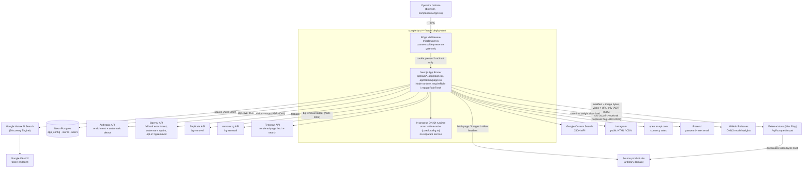
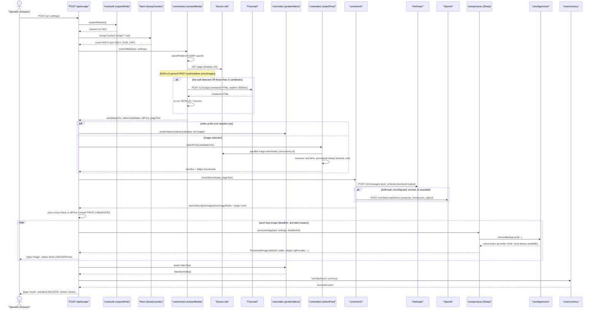
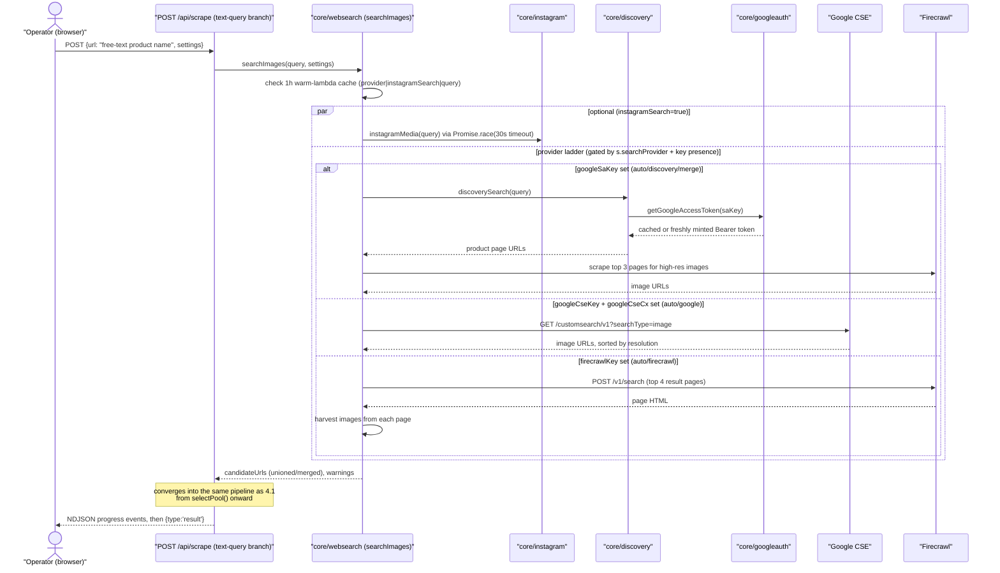
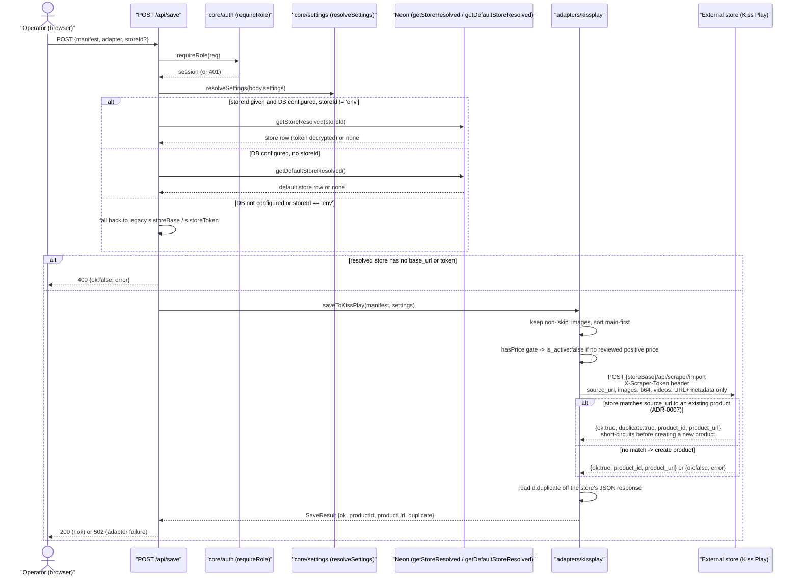
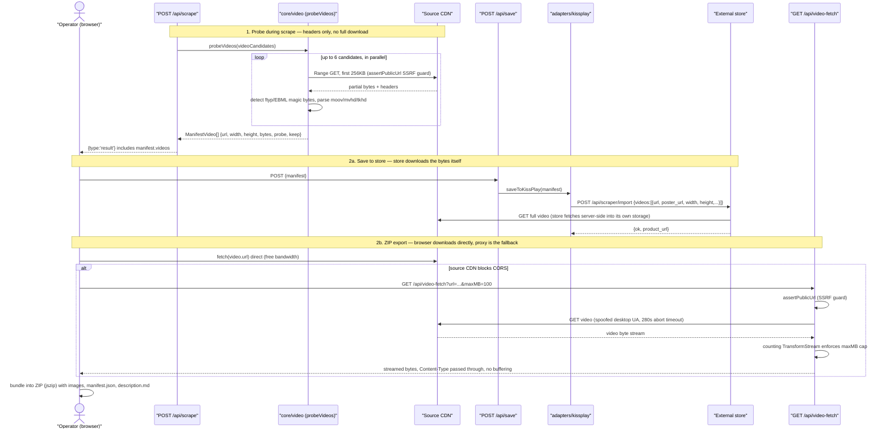

> Generated: 2026-07-26 · Commit: 2f26e26 · Generator: make-docs

# Architecture — scraper-pro

scraper-pro is a single Next.js application: one product-image/video scraping pipeline, one
Postgres database, and a set of external AI/search/storage providers it calls out to. There is
no separate backend service, no queue, and no worker fleet — every pipeline run executes inside
one Vercel serverless function for the lifetime of one HTTP request.

## 1. Context — who talks to the system

| Actor | What they do | Auth |
|---|---|---|
| **Operator** (role `operator`) | Runs the tool surface: scrape a URL or product name, review images/video/price, save to a store or download a ZIP | Signed session cookie, any role |
| **Admin** (role `admin`) | Everything an operator can do, plus `/admin`: manage provider keys, save-destination stores, and users | Signed session cookie, `role==='admin'`, DB-freshness-checked on mutations |
| **External "store" (Kiss Play)** | Receives finished product manifests via its own `/api/scraper/import` endpoint; downloads product video bytes itself | Shared secret token (`X-Scraper-Token`), issued by the store, stored encrypted here |
| **Source product sites** (arbitrary domains, e.g. Temu/AliExpress-class marketplaces) | Passive — the system fetches their pages/images/video headers | None (public HTTP) |
| **AI / search / storage providers** | Anthropic, OpenAI, Replicate, remove.bg, Firecrawl, Google (Vertex AI Search + Custom Search), Instagram, Resend, open.er-api.com, GitHub Releases | Per-provider API keys, resolved server-side (see [ADR-0003](./adr/0003-encrypted-config-in-postgres.md)) |

Exactly two roles exist system-wide — `admin` and `operator` (`components/App.tsx:12,34`, enforced
server-side in every admin route via `requireRoleFresh(req,'admin')`, e.g.
`app/api/users/route.ts:13,19,33,52`). There is no public/anonymous surface beyond the login and
password-reset pages.

## 2. Containers

Containers, not services — everything under "Vercel deployment" above is **one deployable unit**:

| Container | Runtime | Responsibility |
|---|---|---|
| Edge Middleware (`middleware.ts`) | Vercel Edge | Redirects unauthenticated page requests to `/login`; redirects the `admin.` subdomain's `/` to `/admin`. Deliberately does **not** import `core/auth` — checks cookie *presence* only, not validity (`middleware.ts:6-7,12`). Not the security boundary. |
| Next.js App Router (`app/**`) | Vercel Node serverless functions, `runtime='nodejs'`, `dynamic='force-dynamic'` on every route | Every API route, every page, the single client component `components/App.tsx` (992 lines) that renders both the operator tool surface and the admin surface. |
| In-process ONNX runtime (`core/localbg.ts`) | Same Node function, no network service | Free local background-removal fallback; model weights cached in `os.tmpdir()`. |
| Neon Postgres | Managed serverless Postgres (`@neondatabase/serverless`) | Three tables: `app_config` (encrypted provider keys + admin settings + daily-usage counters), `stores` (save destinations), `users` (auth + roles + reset tokens). See [ADR-0003](./adr/0003-encrypted-config-in-postgres.md). |

## 3. Key components (pipeline)

| Component | File | Responsibility |
|---|---|---|
| Auth | `core/auth.ts` | Stateless HMAC-signed session cookies, `requireRole`/`requireRoleFresh` guards, reset tokens. |
| Settings resolver | `core/settings.ts` | DB → env → client-supplied resolution for every provider key/setting; `configStatus()`, `saveConfigKeys()`. |
| Extract | `core/extract.ts` | URL → candidate images/videos/page text. SSRF guard, JSON-LD-first parsing, Firecrawl render escalation. |
| Select | `core/select.ts` | Download pool → measure real dimensions → perceptual dedup → rank → shortlist. See [ADR-0006](./adr/0006-perceptual-hash-image-dedup.md). |
| Web search | `core/websearch.ts` | Text-query → image URLs, provider ladder (Instagram / Discovery Engine / merge / Google CSE / Firecrawl). |
| Discovery Engine client | `core/discovery.ts` | Google Vertex AI Search calls for product pages/images. |
| Google auth | `core/googleauth.ts` | Hand-rolled service-account JWT → OAuth2 Bearer token. See [ADR-0004](./adr/0004-hand-rolled-google-service-account-jwt.md). |
| Instagram | `core/instagram.ts` | Public post/reel media extraction, 3-rung escalating ladder. |
| Video probe | `core/video.ts` | Range-GET + magic-byte/box parsing to measure video candidates without downloading them. See [ADR-0005](./adr/0005-store-side-video-download.md). |
| Enrich | `core/enrich.ts` | AI copywriting (en/ar/he) + image-role curation, Anthropic → OpenAI. See [ADR-0001](./adr/0001-anthropic-primary-openai-fallback.md). |
| Watermark | `core/watermark.ts` | Vision-detect + inpaint an overlaid watermark/logo on the main image only. |
| Background removal | `core/bgremove.ts` | Provider chain: Replicate → remove.bg → local (always) → OpenAI (opt-in). See [ADR-0002](./adr/0002-free-local-onnx-background-removal-fallback.md). |
| Local ONNX cutout | `core/localbg.ts` | U²-Net/ISNet inference via `onnxruntime-node`, no key, no external call. |
| Process | `core/process.ts` | Sharp pipeline: watermark → cutout → trim → pad → tone → multi-format encode with byte-cap enforcement. |
| Currency | `core/currency.ts` | Live-rate → ILS conversion, price cross-check helper, fallback rate table. |
| Budget | `core/budget.ts` | Deadline-aware timeout helpers threaded through every provider call. |
| DB | `core/db.ts` | AES-256-GCM encrypt/decrypt, scrypt password hashing, all SQL (`app_config`/`stores`/`users`). |
| Save adapter | `adapters/kissplay.ts` | Manifest → the Kiss Play store's `/api/scraper/import`; surfaces the store's duplicate-save short-circuit. See [ADR-0007](./adr/0007-duplicate-save-protection.md). |
| UI | `components/App.tsx`, `app/page.tsx`, `app/admin/page.tsx`, `app/login/page.tsx`, `app/reset/page.tsx` | Single client component switched by a server-set `mode: 'tool' \| 'admin'` prop; standalone login/reset pages. |

## 4. Flows

The four flows below are traced from the actual route handlers and core modules, not inferred
from UI copy. NDJSON events shown match the `ProgressEvent` union (`core/types.ts:59-66`).

### 4.1 Scrape a product URL — `POST /api/scrape` (URL branch)

Source: `app/api/scrape/route.ts` (orchestrator), `core/extract.ts`, `core/select.ts`,
`core/enrich.ts`, `core/process.ts`, `core/bgremove.ts`, `core/currency.ts`, `core/video.ts`.

In-stream error conditions (e.g. no candidate images found, all image processing fails) are sent
as `{type:'error', message}` NDJSON events at HTTP 200, since headers are already flushed by the
time an error can occur — the client must inspect the stream, not the status code.

### 4.2 Search by product name — `core/websearch.ts` provider ladder

Source: `app/api/scrape/route.ts:81-92` (text-query branch), `core/websearch.ts:36-154`
(`searchImages`/`searchImagesUncached`), `core/discovery.ts`, `core/googleauth.ts`,
`core/instagram.ts`. The same ladder, entered via `searchProductPages()`
(`core/websearch.ts:158-204`), also powers `POST /api/discover`'s category/listing mode.

### 4.3 Save to store — `POST /api/save` → `adapters/kissplay.ts`

Source: `app/api/save/route.ts:14-45`, `adapters/kissplay.ts:11-66`, `core/db.ts:97-107` (token
decryption inside `resolveRow()`). The `is_active:false`-on-no-price safety invariant
(`adapters/kissplay.ts:20-23,33`) means nothing goes live at ₪0 regardless of the `publish` setting.

The store enforces idempotency by `source_url`; this app only surfaces the result. This app
already sent `source_url: m.sourceUrl` in the payload (`adapters/kissplay.ts:34`) before the store
added the check — no payload change was needed here, only reading the extra `duplicate` field off
the response (`adapters/kissplay.ts:62`) and forwarding it through `NextResponse.json(r, ...)`
unchanged (`app/api/save/route.ts:40-41`). The UI treats a duplicate as a successful save, not an
error: `save()` shows "↩ محفوظ مسبقًا" instead of "✓ انحفظ بالمتجر" (`components/App.tsx:416`), and
batch-mode `saveProduct()` logs a warn-level "↩ منتج N محفوظ مسبقًا" line while still marking the
product saved (`components/App.tsx:434,436`). See
[ADR-0007](./adr/0007-duplicate-save-protection.md). This repo does not implement or control the
store's matching logic (schema, indexing, SQL) — that lives in a different repo; see
[Boundaries](#6-boundaries--what-this-system-deliberately-does-not-do).

### 4.4 Video probe + download

Source: `core/video.ts` (probe), `adapters/kissplay.ts:36-40,53-59` (store-side download comment
and the widened 280s timeout), `app/api/video-fetch/route.ts` (proxy fallback), `components/App.tsx:459-462`
(client tries a direct fetch before falling back to the proxy). See
[ADR-0005](./adr/0005-store-side-video-download.md).

## 5. Key design decisions

Inline pointers into the ADR log — see each file for Context/Decision/Consequences:

- AI provider order for enrichment and watermark detection — [ADR-0001](./adr/0001-anthropic-primary-openai-fallback.md)
- Background-removal ladder always has a free, keyless fallback — [ADR-0002](./adr/0002-free-local-onnx-background-removal-fallback.md)
- Provider keys and store tokens live encrypted in Postgres, not only in env vars — [ADR-0003](./adr/0003-encrypted-config-in-postgres.md)
- Google service-account auth is hand-rolled, not a library — [ADR-0004](./adr/0004-hand-rolled-google-service-account-jwt.md)
- Video bytes never transit this app at scrape time — [ADR-0005](./adr/0005-store-side-video-download.md)
- Image dedup is content-aware (perceptual hash), not URL-based — [ADR-0006](./adr/0006-perceptual-hash-image-dedup.md)
- Duplicate-save protection is enforced store-side by `source_url`; this app surfaces the result — [ADR-0007](./adr/0007-duplicate-save-protection.md)

## 6. Boundaries — what this system deliberately does NOT do

- **Never stores video bytes itself.** The probe stage Range-GETs only the first 256KB of each
  candidate (`core/video.ts:82`). At save time, the destination store downloads the full video
  server-side from the original source URL — this app forwards `{url, poster_url, width, height,
  bytes, content_type}`, never bytes (`adapters/kissplay.ts:38-40`). See
  [ADR-0005](./adr/0005-store-side-video-download.md). The one partial exception is the
  client-initiated ZIP-export fallback proxy (`GET /api/video-fetch`), which streams bytes through
  without buffering the whole file, only when the browser's own direct fetch is CORS-blocked.
- **No queue, no worker fleet, no background jobs.** Every scrape, discover, or save request runs
  synchronously inside one Vercel Node serverless function for the duration of that HTTP request
  (`maxDuration: 300` on `/api/scrape`, `/api/save`, `/api/video-fetch`, `vercel.json:1-8`). There
  is no job table, no retry queue, and no process outside the request/response cycle.
- **CI is type-check-only — no test suite, no CD.** `.github/workflows/typecheck.yml` runs on every
  push/PR to `master`: checkout → pnpm 9 → Node 22 → `pnpm install --frozen-lockfile
  --ignore-scripts` → `pnpm typecheck` (`tsc --noEmit`). This is the repo's first CI of any kind
  and closes the gap previously documented here, but it stays narrow on purpose: `--ignore-scripts`
  skips `sharp`/`onnxruntime-node`'s native postinstall builds because the type-check only needs
  their `.d.ts` files, which keeps the job fast and avoids native-build flakiness
  (`.github/workflows/typecheck.yml:28-30`). There is still no automated test suite (`package.json`
  has no `test` script) and no ESLint config, and CI does not deploy anything — deploys stay
  manual: `vercel` for preview, `vercel --prod` for production.
- **No client-bundled secrets.** A repo-wide grep for `NEXT_PUBLIC_*` finds no matches — every
  provider key and store token stays server-side; the client only ever sees boolean "is a key
  configured" flags (`GET /api/status`, `GET /api/config`).
- **Edge middleware is not the security boundary.** `middleware.ts` checks session-cookie
  *presence* only, for coarse page-level redirects. Every API route independently re-verifies the
  signed cookie and role via `requireRole`/`requireRoleFresh` in `core/auth.ts` running in the
  Node runtime (`core/auth.ts:3-5`).
- **No HLS/ffmpeg support.** Pages that only expose `.m3u8` video get a warning but no video
  output — there is no ffmpeg in this stack (`core/extract.ts:65-68,78,200,280-287`).
- **No video transcoding of any kind.** The probe stage parses container metadata (magic bytes,
  `moov`/`mvhd`/`tkhd` boxes) from partial Range responses; it never decodes, re-encodes, or
  generates thumbnails from video frames server-side.
- **No filesystem persistence for processed media.** Images are held in memory as Sharp buffers
  and shipped to the client as base64 `dataUrl`s inside the NDJSON stream and the final manifest;
  nothing is written to local disk except the one-time ONNX model-weight cache in `os.tmpdir()`.
- **No schema migrations, no ORM.** The Postgres schema is not version-controlled anywhere in the
  repo — table shape is inferred entirely from the hand-written SQL in `core/db.ts` (confirmed: no
  `CREATE TABLE`/migration file exists in the tree).
- **No multi-tenant/organization layer.** Exactly two roles exist, `admin` and `operator`
  (`core/auth.ts:14`) — there is no concept of teams, workspaces, or per-customer isolation beyond
  the `stores`/`users` tables.
- **No IP-based rate limiting or WAF.** The only throttling is a per-user daily counter on
  `/api/scrape` (`DAILY_RUN_CAP`, default 400) and `/api/discover` (`DAILY_DISCOVER_CAP`, default
  150), both stored as `app_config` rows keyed by day and user id (`core/db.ts:79-86`).
- **No duplicate-detection logic of its own.** This app never owns product storage, so it cannot
  independently know whether a manifest it's about to save already exists as a live product — that
  check (matching on `source_url`) runs store-side. This app only reads the `duplicate` field the
  store returns and surfaces it to the operator (`adapters/kissplay.ts:62`). See
  [ADR-0007](./adr/0007-duplicate-save-protection.md).
