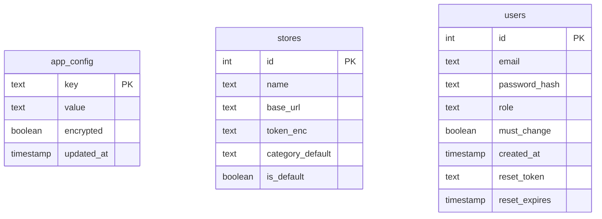

> Generated: 2026-07-26 · Commit: 0f2c759 · Generator: make-docs

# Database

Scraper Pro stores all persistent state in **Neon Postgres** (serverless
Postgres), accessed through the `@neondatabase/serverless` driver
(`package.json:13`, `^1.1.0`). The entire data layer — connection, encryption,
password hashing, and every query in the app — lives in one file:
[`core/db.ts`](../core/db.ts) (192 lines). No other file in the repo issues a
SQL query (confirmed by a repo-wide grep for the `sql` tagged template).

> ⚠️ TODO(owner): confirm the schema history. No `CREATE TABLE`, migration
> file, or `schema.sql` exists anywhere in the repo (whole-tree search found
> no matches) — the schema below is reverse-engineered entirely from the SQL
> statements in `core/db.ts`. There is no migration tool (no Prisma, no
> Drizzle, no raw `.sql` migration folder) and no record of how the three
> tables below were originally created in the live Neon project.

## Connection

- `DATABASE_URL` env var, read lazily — `neon(DATABASE_URL)` is constructed on
  the **first query**, not at import time, so a build or a Preview deploy
  without `DATABASE_URL` set never crashes (`core/db.ts:5-14`).
- `dbConfigured()` = `Boolean(process.env.DATABASE_URL)` (`core/db.ts:18`).
  Every route that touches the DB checks this first and returns `503
  {error:'DATABASE_URL not set — server storage unavailable'}` (or an
  equivalent message) instead of throwing. See
  [API-REFERENCE.md](./API-REFERENCE.md) for the exact per-route behavior.
- Runtime introspection: `dbHealth()` (`core/db.ts:186-192`) runs
  `SELECT table_name FROM information_schema.tables WHERE table_schema='public'`
  and returns the live table list. This is the only place in the code that
  could reveal whether tables beyond the three documented here exist in the
  deployed database. It backs `GET /api/db-health` (admin-only for the full
  table list; other roles get `{ok: boolean}` only).

## Entity-relationship diagram



There are **no foreign keys between these tables** — no column in `stores` or
`users` references another table, and vice versa. Each table is queried and
mutated independently in `core/db.ts`. The three tables are not relational to
each other; they simply share one Postgres database.

## `app_config`

**Purpose**: a generic encrypted key/value store. It holds three unrelated
kinds of data under one schema: provider API keys entered in the admin panel,
non-secret admin settings (store base URL, sender address, etc.), the app
password, and — reused rather than a separate table — **daily per-user usage
counters** (`core/db.ts:1`, `:60, 78-86`).

| Column | Type (inferred) | Notes |
|---|---|---|
| `key` | `text`, **primary key** | Either a raw setting name (e.g. `anthropicKey`, `appPassword`) or a counter key `ctr:<YYYY-MM-DD>:<name>` (`core/db.ts:81`). |
| `value` | `text` | Plaintext, or an AES-256-GCM blob `iv.tag.ct` (base64 segments) when `encrypted=true`. Counter values are stored as decimal-string integers. |
| `encrypted` | `boolean` | Whether `value` must be run through `decrypt()` before use. |
| `updated_at` | `timestamp` | Set to `now()` on every insert/update. |

**Constraints**: `ON CONFLICT (key) DO UPDATE` in `setConfig()`
(`core/db.ts:68-69`) implies a unique constraint or primary key on `key`.

**Access functions** (`core/db.ts:61-86`):
- `getConfig(key)` — `SELECT value, encrypted FROM app_config WHERE key = ${key}`; decrypts if `encrypted`.
- `setConfig(key, value, encrypted)` — upsert.
- `getAllConfig()` — full table scan, returns a flat `{key: value}` map (used by `resolveSettings`, see [CONFIGURATION.md](./CONFIGURATION.md)).
- `bumpCounter(key, by=1)` — upserts `ctr:<today>:<key>`, incrementing `value::int`, returns the new count.

**Encryption**: AES-256-GCM. Key = SHA-256 of `APP_SECRET` (falls back to the
literal `'dev-insecure-change-me'` outside production). Fails closed in
production — throws if `NODE_ENV==='production'` and `APP_SECRET` is unset or
under 16 characters (`core/db.ts:21-28`). `encrypt()` produces
`iv.base64.authTag.base64.ciphertext.base64`; `decrypt()` returns `''` on any
parse or auth-tag failure instead of throwing (`core/db.ts:29-44`). Which
setting keys get encrypted is controlled by the `NON_SECRET` allowlist in
`core/settings.ts:54` (URLs, ids, sender addresses stay plaintext; every API
key and the app password are encrypted) — see
[CONFIGURATION.md](./CONFIGURATION.md) for the full key list.

**Access control**: no Postgres-level access control (no RLS policies exist
anywhere in this repo — confirmed by grep). All gating happens in the route
handlers via `requireRole`/`requireRoleFresh` before a query is ever issued
(`GET /api/config` any role, `POST /api/config` admin-only — see
[API-REFERENCE.md](./API-REFERENCE.md)).

## `stores`

**Purpose**: one row per save/export destination the scraper can push a
finished product manifest to (an admin can configure multiple downstream
"stores"). The destination auth token is encrypted at rest
(`core/db.ts:88`).

| Column | Type (inferred) | Notes |
|---|---|---|
| `id` | integer, **primary key** | `serial`/int — `RETURNING id` on insert (`core/db.ts:124-126`). |
| `name` | `text` | Required, trimmed (`core/db.ts:109, 113`). |
| `base_url` | `text` | Required, trimmed, trailing slashes stripped (`core/db.ts:110, 113`). |
| `token_enc` | `text` | `encrypt()`'d import token, or `''` if none set. Never returned by `listStores()` — only a derived `has_token` boolean is exposed. |
| `category_default` | `text` | Defaults to `'toys'` if not supplied (`core/db.ts:111`). |
| `is_default` | `boolean` | At most one row should have this `true`. |

**Constraints**:
- "At most one default" is enforced at the **application layer**, not by a
  DB constraint: `upsertStore()` runs
  `UPDATE stores SET is_default = false WHERE is_default = true` before
  inserting/updating a row with `is_default=true` (`core/db.ts:114`). A
  concurrent write could theoretically race this — no DB-level unique
  partial index backs it.
- No unique constraint on `name` or `base_url` is evidenced in the code (two
  stores could share a name).

**Access functions** (`core/db.ts:92-129`):
- `listStores()` — never returns `token_enc`; returns `has_token` (`token_enc <> ''`) instead. Ordered `is_default DESC, id`.
- `getStoreResolved(id)` / `getDefaultStoreResolved()` — decrypt `token_enc` into a plaintext `token` field for server-side use only (`resolveRow()`, `core/db.ts:97-101`).
- `upsertStore(i)` — update-or-insert; only re-encrypts `token_enc` when a **new, non-empty** token is supplied, so editing a store's name doesn't require re-sending its secret token.
- `deleteStore(id)` — hard `DELETE`.

**Access control**: `GET /api/stores` is open to any logged-in role
("base URLs aren't secret" — comment at `app/api/stores/route.ts:6`) and
strips tokens before responding. `POST`/`DELETE /api/stores` and
`POST /api/stores/test` require `requireRoleFresh(req, 'admin')`. See
[API-REFERENCE.md](./API-REFERENCE.md).

## `users`

**Purpose**: application authentication (admin/operator roles) and the
password-reset flow (`core/db.ts:132`).

| Column | Type (inferred) | Notes |
|---|---|---|
| `id` | integer, **primary key** | |
| `email` | `text` | Looked up case-insensitively via `lower(email) = lower(${email})` (`core/db.ts:135`). Stored lower-cased on insert (`core/db.ts:152`). |
| `password_hash` | `text` | Format `scrypt.<saltB64>.<hashB64>` (`core/db.ts:47-50`). |
| `role` | `text` | `'admin' \| 'operator'` (`core/auth.ts:14`). |
| `must_change` | `boolean` | `true` for freshly created accounts and after an admin resets a password (`core/db.ts:150-152, 155-157`); forces the user to change their password on next login. |
| `created_at` | `timestamp` | |
| `reset_token` | `text`, nullable | **SHA-256 hash** of a raw reset token, never the raw token itself (`core/auth.ts:99-105`). |
| `reset_expires` | `timestamp`, nullable | Reset-token TTL is 30 minutes (`core/auth.ts:12`). |

**Constraints**:
- `email` has no explicit `UNIQUE` constraint evidenced in `core/db.ts`, but
  `POST /api/users` checks `getUserByEmail` first and returns `409 {error:
  'الإيميل مستخدم مسبقاً'}` on a match (`app/api/users/route.ts:27`) — this is
  an app-layer duplicate check, not a guaranteed DB-level guarantee against a
  race.
  > ⚠️ TODO(owner): confirm whether a `UNIQUE` index exists on `users.email`
  > at the database level, or whether the app-layer check is the only guard.
- **"Keep ≥1 admin" is enforced atomically at the SQL level**, not just in
  application code: `deleteUserGuarded(id)` and `setUserRoleGuarded(id, role)`
  embed the admin-count check directly in the mutating statement's `WHERE`
  clause —
  ```sql
  DELETE FROM users WHERE id = $1
    AND (role <> 'admin' OR (SELECT count(*) FROM users WHERE role = 'admin') > 1)
  ```
  (`core/db.ts:166-176`) — so a concurrent check-then-act race cannot drop the
  last admin; the statement simply affects zero rows and the caller returns
  `false`.

**Access functions** (`core/db.ts:134-183`): `getUserByEmail`, `getUserById`,
`listUsers` (excludes `password_hash`/`reset_token`), `countUsers`,
`createUser`, `setUserPassword`, `setUserRole`/`setUserRoleGuarded`,
`deleteUser`/`deleteUserGuarded`, `setResetToken`, `getUserByValidResetHash`.

**Access control**: all four `/api/users` verbs require
`requireRoleFresh(req, 'admin')` — the freshness check re-reads the caller's
role from the DB on every call, so a demoted or deleted admin's still-valid
session cookie is rejected immediately rather than trusted for the rest of
its 24h TTL (`core/auth.ts:70-78`). See [API-REFERENCE.md](./API-REFERENCE.md).

## Data-lifecycle notes

- **Daily safety-cap counters reuse `app_config` — no dedicated table.**
  `bumpCounter(key)` upserts a row keyed `ctr:<YYYY-MM-DD>:<key>`
  (`core/db.ts:78-86`), used for `scrape:<uid>` (`DAILY_RUN_CAP`, default 400,
  `app/api/scrape/route.ts:29-35`) and `discover:<uid>` (`DAILY_DISCOVER_CAP`,
  default 150, `app/api/discover/route.ts:97-101`). A new key row is created
  every calendar day per user/route pair.
  > ⚠️ TODO(owner): no cleanup/expiry job for old `ctr:*` rows was found
  > anywhere in the repo — they appear to accumulate in `app_config`
  > indefinitely. Confirm whether a periodic purge exists outside this repo
  > (e.g. a manual query, a Neon-side job) or whether this is an open gap.

- **Secrets are encrypted at rest, decrypted only in-process.** Every provider
  API key, the app password, and store import tokens are AES-256-GCM
  encrypted before being written to `app_config.value` / `stores.token_enc`.
  Decryption happens only inside route handlers that need the live value
  (`resolveSettings`, `getStoreResolved`); list endpoints (`GET /api/stores`,
  `GET /api/config` status) never return decrypted secrets to the client.

- **Password-reset tokens are single-use and self-clearing.** `makeResetToken()`
  generates 32 random bytes; the raw hex value is emailed to the user and only
  its SHA-256 hash is persisted (`core/auth.ts:99-105`) — a leaked
  `reset_token` DB column value cannot be replayed as a working token.
  `getUserByValidResetHash(hash)` requires `reset_expires > now()`
  (`core/db.ts:180-182`), enforcing the 30-minute TTL at query time rather
  than via a background sweep. On any successful password change —
  self-service (`change-password`) or via a redeemed reset token —
  `setUserPassword()` nulls both `reset_token` and `reset_expires`
  (`core/db.ts:156`), so a token can't be reused after the password it was
  issued for has already changed.
  > ⚠️ TODO(owner): an issued-but-never-redeemed reset token remains in the
  > `users` row (hashed) until it either expires (30 min, checked at read
  > time) or a new reset/password-change overwrites it. No background job
  > clears expired `reset_token`/`reset_expires` values proactively — they're
  > just never matched again after expiry. Confirm whether this is
  > acceptable or whether a cleanup pass is wanted.

- **Hard deletes only — no soft-delete or archive column on any table.**
  `deleteStore(id)` and `deleteUser(id)`/`deleteUserGuarded(id)` issue plain
  `DELETE` statements. There is no `deleted_at`, `is_archived`, or audit-trail
  column anywhere in the schema. Deleting a store or a user is irreversible
  at the application layer.

- **No cascading relations to worry about.** Because `app_config`, `stores`,
  and `users` share no foreign keys, deleting a store or a user never orphans
  rows in another table.

- **Schema changes are not version-controlled.** There is no migration
  history to consult for how a column was added or renamed — `core/db.ts`'s
  SQL statements are the only surviving description of the schema. Any manual
  schema change made directly against the Neon project (e.g. via its SQL
  console) would not be reflected anywhere in this repo.

## Related docs

- [CONFIGURATION.md](./CONFIGURATION.md) — full env var reference, including
  how `resolveSettings` layers DB config over env vars.
- [API-REFERENCE.md](./API-REFERENCE.md) — every route that reads or writes
  these tables, with request/response shapes and error codes.
- [ARCHITECTURE.md](./ARCHITECTURE.md) — where the DB sits in the overall
  system, and the auth flow that depends on `users`.
