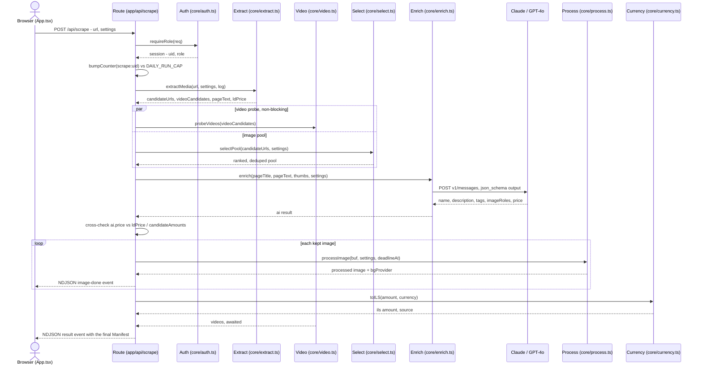

> Generated: 2026-07-26 · Commit: 2f26e26 · Generator: make-docs

# Onboarding

Day-1 path for a new engineer on Scraper Pro: get it running, walk one request
through the whole pipeline, understand how a change gets verified, and pick up
the conventions the git history actually uses.

## Day 1: get it running

Follow the [Quick start](../README.md#quick-start) in the root README —
`pnpm install`, an optional `.env.local`, `pnpm dev`. It isn't repeated here.

Two things the Quick start doesn't cover:

- **Logging in.** The app is gated by signed session cookies (`core/auth.ts`)
  and two roles, `admin` and `operator` (`core/auth.ts:14`). Every page except
  `/login` and `/reset` redirects to `/login` when there's no session cookie
  (`middleware.ts:19-23`).
- **Getting your first admin account.** `POST /api/users` — the only way to
  create a user — itself requires an existing admin session
  (`requireRoleFresh(req, 'admin')`, `app/api/users/route.ts:19`). No seed
  script or bootstrap exception exists anywhere in the repo: `core/db.ts`
  defines `countUsers` (`:146`) but nothing in the codebase calls it.

  > ⚠️ TODO(owner): confirm how the first admin user is meant to be created on
  > a fresh database — a direct SQL insert against `users`, or a bootstrap
  > step that doesn't exist in this repo yet.

Once you have a session, it's one Next.js app either way: `components/App.tsx`
renders both the operator tool (`mode="tool"`) and the admin surface
(`mode="admin"`), gated server-side by `app/page.tsx` and `app/admin/page.tsx`
respectively.

## Guided tour: one request end to end

The fastest way to learn this codebase is to trace one real request through
it. This tour follows **`POST /api/scrape`** — paste a product URL, get back a
`Manifest` — from the tool's main "🚀 معالجة" button
(`components/App.tsx`, search mode `product`) all the way to the streamed
result.

```json
POST /api/scrape
{ "url": "https://example-shop.com/products/gadget-123.html" }
```

The response isn't one JSON object — it's a stream of newline-delimited
`ProgressEvent`s (`core/types.ts:59-66`), sent as
`Content-Type: application/x-ndjson` (`app/api/scrape/route.ts:257-259`), and
it ends with exactly one `{"type":"result","manifest":...}` line.



### 1. Gate and safety cap — `app/api/scrape/route.ts:24-35`
`requireRole(req)` (`core/auth.ts:61-66`) verifies the `sp_session` cookie's
HMAC signature and role, no DB round-trip. If `DATABASE_URL` is set, a
per-user daily counter (`bumpCounter('scrape:'+uid)`, `core/db.ts:79-86`) is
checked against `DAILY_RUN_CAP` (default 400) — over the cap returns `429`
before the stream is even opened.

### 2. Settings resolution — `app/api/scrape/route.ts:44`
`resolveSettings(body.settings)` (`core/settings.ts:57-78`) resolves every
setting — `anthropicKey`, `maxImages`, `bgMode`, and the rest — in one fixed
order: DB (`app_config`, admin-editable) → env var → client-supplied value.
This one function is the answer to "where does this config value come from."

### 3. Extraction — `core/extract.ts:extractMedia`, called `app/api/scrape/route.ts:77`
Since the input is a URL (not a search query), `extractMedia` runs: an SSRF
guard (`assertPublicUrl`, `core/extract.ts:45-56`) → a plain fetch of the page
→ JSON-LD `Product`/`Offer` parsing first, treated as authoritative for price
and gallery (`core/extract.ts:101-125`) → generic `og:image`/``/`srcset`
harvest → a Firecrawl rendered-fetch escalation, only if fewer than 3 images
were found and a Firecrawl key is configured (`core/extract.ts:251-267`).
Returns candidate image URLs, video URLs, page text, and any JSON-LD price.

### 4. Video probe and image selection run concurrently
- `probeVideos()` (`core/video.ts:29-61`) is kicked off as a non-awaited
  promise (`app/api/scrape/route.ts:105-107`) — it only Range-fetches the
  first 256KB of each video candidate, so it finishes inside the image
  pool's download window instead of adding to the request's wall time.
- `selectPool()` (`core/select.ts`, called `app/api/scrape/route.ts:111`)
  downloads the candidate images in parallel, measures real dimensions with
  `sharp().metadata()`, drops icons and banner-shaped images, perceptually
  dedupes (8×8 average-hash, Hamming distance ≤6), and ranks by megapixels.

### 5. AI enrichment — `core/enrich.ts:enrich`, called `app/api/scrape/route.ts:120`
Thumbnails of the shortlisted pool go to **Claude first**
(`callAnthropic`, `core/enrich.ts:97-125`) using structured `json_schema`
output, so a malformed response is grammar-impossible on this path. On a
missing key, an error, or an unusable response, it falls back to
**OpenAI GPT-4o** (`core/enrich.ts:127-145`). The model returns localized
name/description (en/ar/he), tags, a price guess, and a role
(`main`/`angle`/`detail`/`skip`) per thumbnail.

### 6. Price cross-check — `app/api/scrape/route.ts:138-155`
The AI's price is trusted only if it matches the JSON-LD price or a number
mined straight from the page's own text (`candidateAmounts`,
`core/currency.ts:40-49`) — otherwise it's dropped with a warning, since it's
either hallucinated or injected by a hostile page. A missing AI price is
backfilled from the JSON-LD price when one exists.

### 7. Per-image processing loop — `app/api/scrape/route.ts:158-184`
For each kept image, `processImage()` (`core/process.ts:30-122`) runs:
optional watermark removal (main image only) → background removal
(`core/bgremove.ts`'s provider ladder: Replicate → remove.bg → free local
ONNX → optional OpenAI) → trim → pad onto a transparent canvas → tone
(brightness/contrast/sharpen) → multi-format encode under the `maxKB` byte
cap. Each image streams its own `{"type":"image","status":"done"|"failed"}`
event as it finishes — this is what drives the progress bar in the UI.

### 8. Guaranteed-result fallback — `app/api/scrape/route.ts:186-204`
If the loop above produced zero images (for example, the local ONNX model's
first-run weight download plus a slow search ate the whole time budget), the
top-ranked pool candidate is reprocessed with `bgMode:'off'` so the run never
comes back completely empty.

### 9. Price → ILS — `app/api/scrape/route.ts:208-230`
`toILS()` (`core/currency.ts:52-66`) converts using live exchange rates
(6h in-process cache, static fallback table if the rate API is unreachable).
An amount with no detected currency is never assumed to be ILS — it's
surfaced as a manual-review warning instead of risking a silently ~4x-wrong
price.

### 10. Manifest assembly and emission — `app/api/scrape/route.ts:232-249`
The (now-awaited) video probe result, the processed images, the price, and
the AI copy are assembled into a `Manifest` (`core/types.ts:38-56`) and sent
as the final `{"type":"result","manifest":...}` line. The stream closes right
after.

### What you see in the browser
`components/App.tsx:649-693` reads that NDJSON stream and drives the progress
bar, the scrolling log, and the cost card; once the `result` event lands, the
single-product review grid (`components/App.tsx:744-838`) renders the
manifest for editing before save. The request/response contract above is
complete without the UI, though — every field the UI shows came from a
`ProgressEvent` documented in step 10.

## Testing workflow

There is still no automated test suite in this repo. `package.json` defines
exactly four scripts — `dev`, `build`, `start`, `typecheck` — no `test`
script exists, `git ls-files` finds zero `*.test.*`/`*.spec.*` files, and no
test framework (Jest, Vitest, Playwright, …) is a dependency.

What did change: `.github/workflows/typecheck.yml` is this repo's first CI
of any kind. It runs on every push and pull request targeting `master` —
`actions/checkout@v4` → `pnpm/action-setup@v4` (pnpm 9, matching
`lockfileVersion '9.0'` in `pnpm-lock.yaml`) → `actions/setup-node@v4`
(Node 22, with pnpm caching) → `pnpm install --frozen-lockfile
--ignore-scripts` → `pnpm typecheck`. The `--ignore-scripts` is deliberate:
type-checking only needs `.d.ts` files, not `sharp`/`onnxruntime-node`'s
native postinstall builds, so CI stays fast and avoids native-build
flakiness. This closes the "no CI exists" gap that used to be documented
here — but stay aware of how narrow it is: it's a type-check gate only.
Nothing in CI runs the app, calls a provider, or asserts behavior, and the
gap noted below is still real.

> ⚠️ TODO(owner): decide on a test strategy. The pure, network-free pipeline
> modules — `core/select.ts` (dedup/ranking), `core/currency.ts` (conversion
> math), `core/extract.ts`'s JSON-LD parsing — are the cheapest place to start
> unit tests, since they need no provider keys or live network access.

Locally, the same mechanical check CI runs is one command:

```bash
pnpm typecheck   # tsc --noEmit — see docs/CONTRIBUTING.md
```

In practice, verifying a change today means running `pnpm dev` and exercising
the affected flow by hand: paste a real product URL for `/api/scrape`
changes, or drive the admin panel for `/api/config`, `/api/stores`, or
`/api/users` changes. There's no seeded fixture data and no mock provider
layer in this codebase — manual testing against real (or a low-cost dev)
provider keys is the only path today, and CI doesn't do any of it for you.

## Team conventions

### Commit messages
Every commit in `git log` follows `type(scope): summary`, optionally with a
bulleted body, and — in 30 of the 31 commits on this branch — ends with a
`Co-Authored-By: Claude <model> <noreply@anthropic.com>` trailer crediting
the model that helped write it. Real examples from the history:

```
feat(stores): "test compatibility" — verify a store speaks the import protocol
fix(pwa): exclude manifest.webmanifest + sw.js from the auth middleware
style: mobile-first / app-like layout + kill horizontal scroll
```

Types seen: `feat`, `fix`, `style`, `chore`. See
[CONTRIBUTING.md § Commit messages](./CONTRIBUTING.md#commit-messages) for
the full convention and how to write one.

### Branching
Every commit in `git log` sits directly on `master` — there are no merge
commits, and `git branch -a` shows only `master` (plus its remote tracking
branch). No feature-branch naming scheme is evidenced anywhere in this
repo's history. See
[CONTRIBUTING.md § Branching](./CONTRIBUTING.md#branching) for the gap this
leaves open.

### Linting and formatting
No ESLint config exists (no `.eslintrc*` file, no `eslint`/`eslint-config-next`
in `package.json`'s `devDependencies`), and no Prettier config exists either.
`next build` doesn't auto-scaffold ESLint since none is present. TypeScript's
`strict: true` (`tsconfig.json`), checked via `pnpm typecheck`, is the only
enforced code-quality gate in this repo.

### Package manager
pnpm — `pnpm-lock.yaml` and `pnpm-workspace.yaml` sit at the repo root, and
`package.json`'s `pnpm.onlyBuiltDependencies` allow-lists the native builds
required for `sharp` and `onnxruntime-node`.

## Where to go next

| Doc | For |
|---|---|
| [../README.md](../README.md) | Stack, quick start, repository layout |
| [./ARCHITECTURE.md](./ARCHITECTURE.md) | The full system: containers, every flow, design decisions |
| [./API-REFERENCE.md](./API-REFERENCE.md) | Every route's request/response/error shape |
| [./DATABASE.md](./DATABASE.md) | The `app_config`/`stores`/`users` schema this tour touched |
| [./CONTRIBUTING.md](./CONTRIBUTING.md) | Branching, commits, typecheck, PR checklist |
