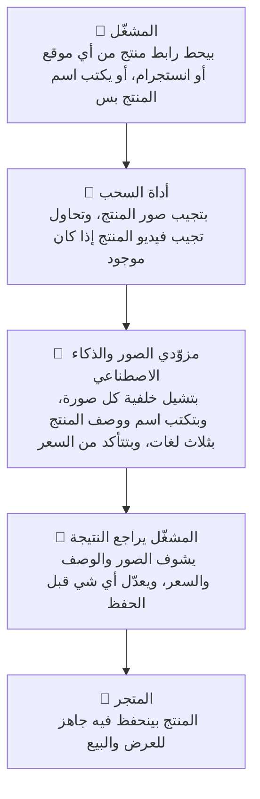

> Generated: 2026-07-26 · Commit: 0f2c759 · Generator: make-docs

# نظرة عامة على النظام

**Scraper Pro** أداة بتوفّرلك وقت وتعب إدخال المنتجات يدويًا: بتاخد رابط منتج من أي موقع إلكتروني، أو رابط منشور/ريل من انستجرام، أو حتى بس اسم المنتج تكتبه ويدوّر عليه — وبترجعلك المنتج جاهز: صور نظيفة بخلفية شفافة (وبتقدر كمان تشيل أي علامة مائية عالصورة الرئيسية)، اسم ووصف مكتوبين تلقائيًا بثلاث لغات (عربي وإنجليزي وعبري) بواسطة الذكاء الاصطناعي، سعر متأكّد منه ومحوّل تلقائيًا للشيكل، وفيديو المنتج إذا كان متوفر بالمصدر — وكل هذا بتراجعه وتعدّل عليه قبل ما تحفظه مباشرة بمتجرك بضغطة زر وحدة، أو تنزّله كملف مضغوط لو حبيت تستخدمه بمكان تاني؛ وبتقدر كمان تخلّي النظام يكتشف ويسحب عدة منتجات مرة وحدة من فئة معيّنة أو من موقع متجر كامل، مش بس منتج واحد.

النظام إله واجهتين: **وضع الأداة** — الشغل اليومي اللي بيستخدمه أي موظف/ة (سحب، مراجعة، حفظ)، و**وضع الإدارة** — خاص بالأدمن بس لضبط مفاتيح الخدمات، المتاجر، والمستخدمين. التفاصيل تحت.

---

## لمحة سريعة على الواجهة

**وضع الأداة** — الشاشة اللي بتشتغل عليها كل يوم:

**وضع الإدارة** — "⚙️ لوحة الإدارة"، بتظهر بس للأدمن:

---

## كيف بيشتغل النظام؟

بكلام بسيط:

1. **المشغّل يبدأ** — يحط رابط منتج (من أي موقع، أو من انستجرام)، أو يكتب اسم المنتج بدون رابط.
2. **أداة السحب تجمع المواد الخام** — تدوّر على أفضل صور المنتج، وتحاول تجيب مقطع فيديو له لو كان موجود بالمصدر.
3. **الذكاء الاصطناعي ومزوّدي الصور يجهّزوا المنتج** — الخلفية بتتشال من كل صورة، والاسم والوصف بينكتبوا تلقائيًا بثلاث لغات، والسعر بينتأكّد منه ويتحوّل للشيكل.
4. **المشغّل يراجع** — يشوف كل صورة وكل جملة وصف والسعر، ويعدّل أي شي مش مظبوط قبل الحفظ. هاي الخطوة دايمًا بإيد الإنسان — النظام ما بيحفظ شي عالمتجر لحاله بدون مراجعة.
5. **الحفظ بالمتجر** — بضغطة زر وحدة المنتج بيتحفظ جاهز للعرض، أو بتقدر تنزّله كملف مضغوط بدل ما تحفظه مباشرة.

> 💡 **الذكاء الاصطناعي (AI)** — برنامج بيقرا صور ونص صفحة المنتج ويكتب وصف تسويقي عنه بنفسه، بدل ما حدا من الفريق يكتبه يدويًا. النظام بيستخدم أكتر من مزوّد (Anthropic وOpenAI)، فإذا وحد وقف مؤقتًا، التاني بياخد مكانه تلقائيًا.

---

## أجزاء النظام

| الجزء من النظام | الوضع | وظيفته | مين بيستخدمه |
|---|---|---|---|
| تسجيل الدخول والخروج | أداة | تدخل للنظام بالإيميل وكلمة السر، وتشوف اسمك ودورك بأعلى الشاشة | مشغّل + أدمن |
| سحب منتج واحد | أداة | تحط رابط منتج (من أي موقع أو من انستجرام) أو تكتب اسمه بس، والنظام يجيبلك صوره ويجهزها | مشغّل + أدمن |
| سحب عدة منتجات دفعة وحدة | أداة | تكتشف وتسحب عدة منتجات مرة وحدة — إما من فئة/نوع معيّن، أو من موقع متجر كامل | مشغّل + أدمن |
| مراجعة الصور والفيديو | أداة | تحدد دور كل صورة (رئيسية / زاوية / تفاصيل)، وتستبعد أي فيديو مش مناسب قبل الحفظ | مشغّل + أدمن |
| تعديل بيانات المنتج | أداة | تعدّل الاسم والوصف بثلاث لغات، السعر، الفئة، وتقرر ينشر فورًا ولا يضل مسودة | مشغّل + أدمن |
| الحفظ للمتجر أو تنزيل ملف | أداة | تحفظ المنتج جاهز بالمتجر مباشرة، أو تنزّله كملف مضغوط لأي استخدام تاني | مشغّل + أدمن |
| خيارات إخراج متقدّمة | أداة | إعدادات دقيقة زي حجم الصورة، الجودة، وإزالة العلامة المائية — غالبًا بتتظبّط مرة وحدة وتضل عليها | مشغّل + أدمن (غالبًا الأدمن بيضبطها) |
| 🧩 التكاملات والمفاتيح | إدارة | إضافة وتجربة مفاتيح مزوّدي الخدمة (الذكاء الاصطناعي، إزالة الخلفية، البحث عن الصور، وغيرها) | أدمن فقط |
| 🏬 وجهات الحفظ — متاجر متعددة | إدارة | إضافة أو تعديل أو حذف المتجر (أو المتاجر) اللي بتنحفظ فيها المنتجات | أدمن فقط |
| 👥 المستخدمون والصلاحيات | إدارة | إضافة أو حذف حسابات، تغيير دور كل مستخدم، وإعادة تعيين كلمة سره | أدمن فقط |

> استرجاع كلمة السر ("نسيت كلمة المرور؟") متاح لأي صاحب حساب من صفحة تسجيل الدخول نفسها — قبل ما يدخل على وضع الأداة أو الإدارة أصلًا.

---

*الملفات ذات الصلة: [دليل التشغيل اليومي](./OPERATIONS.md) · [الصلاحيات والأدوار](./ROLES.md) · [الأسئلة الشائعة](./FAQ.md) · [الدعم والتواصل](./SUPPORT.md)*
